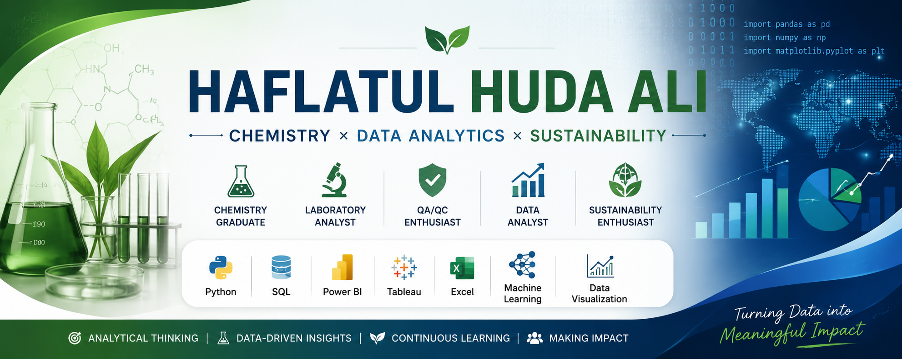

  

# Hi there! 👋

I'm **Haflatul Huda Ali**, a Chemistry graduate with interests in Laboratory Analysis, Quality Assurance/Quality Control (QA/QC), Sustainability Analytics, and Data Analytics.

I enjoy transforming laboratory and business data into meaningful insights through data visualization, machine learning, and business intelligence.

---

## 🌱 About Me

- 🎓 Chemistry Graduate – Universitas Negeri Padang
- 🧪 Interested in QA/QC, Laboratory Analysis & R&D
- 📊 Passionate about Data Analytics & Business Intelligence
- 🌍 Interested in Sustainability & Carbon Analytics
- 📈 Continuously learning Python, SQL, and Power BI

---

## 🛠 Tech Stack

**Programming**

- Python
- SQL

**Data Analytics**

- Power BI
- Tableau
- Microsoft Excel

**Data Science**

- Machine Learning
- Data Visualization
- Exploratory Data Analysis

**Laboratory**

- Analytical Chemistry
- Instrument Analysis
- Quality Control
- Laboratory Testing

---

## 🚀 Featured Projects

### 🌿 CarbonWise – GHG Emission Analytics Dashboard

Interactive Power BI dashboard for monitoring greenhouse gas emissions based on the GHG Protocol.

🔗 https://github.com/haflaali20/carbonwise-ghg-emission-analytics

---

### 📈 Power BI Business Intelligence Dashboard

Business Intelligence dashboard analyzing e-commerce performance using Power BI.

🔗 https://github.com/haflaali20/power-bi-business-intelligence-dashboard

---

### 🏨 Hotel Booking Big Data Analytics

End-to-end analytics project including EDA, customer segmentation, and machine learning using Python.

🔗 https://github.com/haflaali20/hotel-booking-big-data-analysis

---

## 📫 Connect with Me

💼 LinkedIn

https://www.linkedin.com/in/hafla-ali/

📧 Email

hafla.ali20@gmail.com
